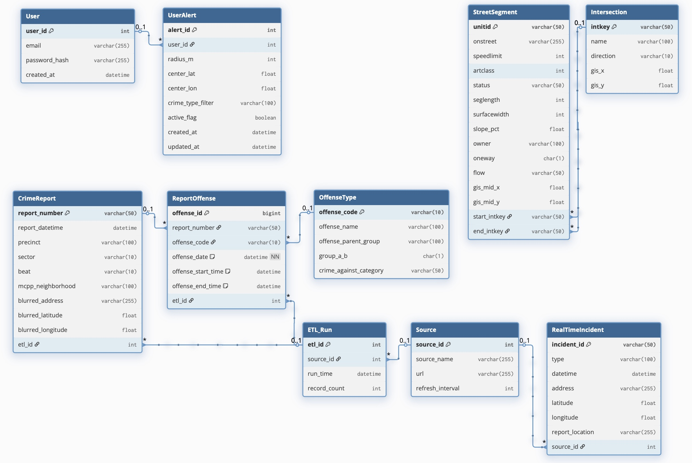
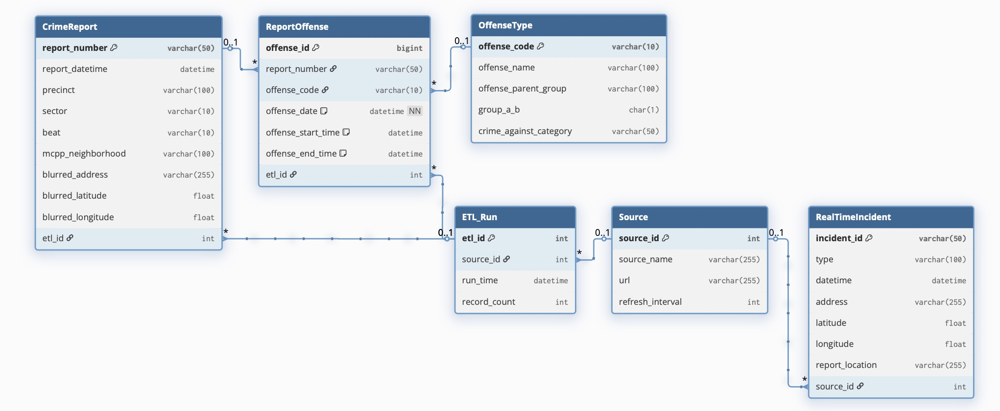
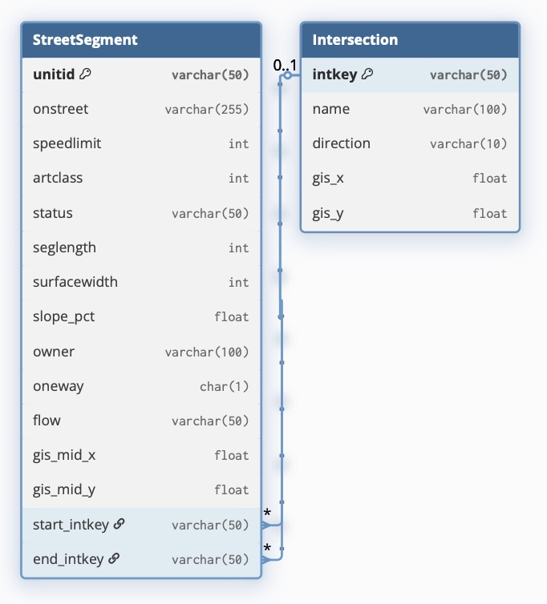
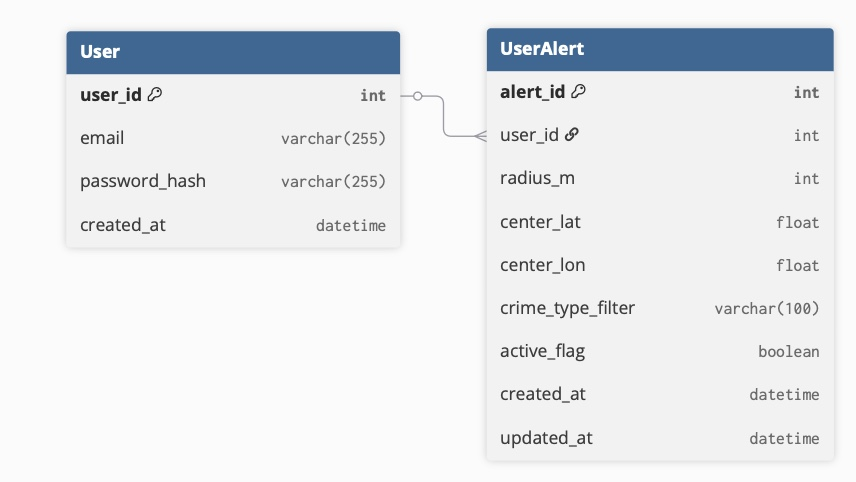
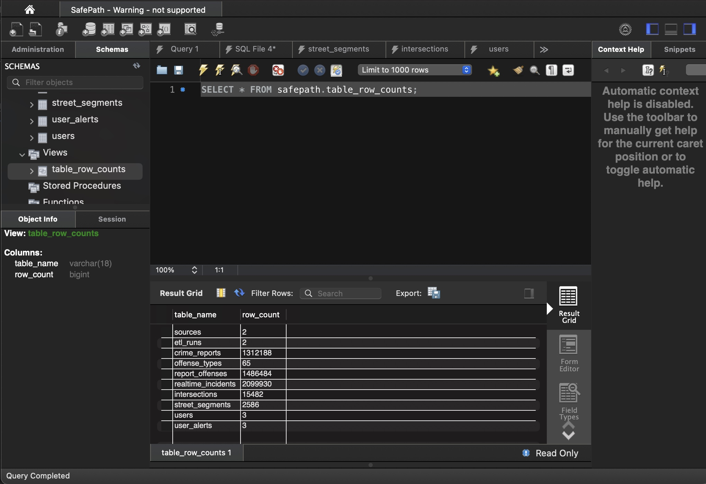

# UML

> At least 10 classes must be defined.



UML is divided into three main parts:

- CrimeReport / OffenseType / ReportOffense + ETL / Source
- StreetSegment / Intersection
- User / UserAlert

These three modules together form a data-driven urban safety system (Urban Safety Intelligence System), which supports historical analysis, real-time monitoring, spatial visualization and user-personalized early warning.


## Crime Information



ETL / Source's goal is to explain how does the system manage this data.

| Table Name | Meaning                                                     |
| ---------- | ----------------------------------------------------------- |
| ETL_Run    | Record "when and how many data is imported into the system" |
| Source     | Record where the data comes from                            |

>###### Why should ETL_Run and Source be separated?
>
>ETL_Run and Source are both metadata, but they are designed separately for the separation of concerns in data modeling.
>
>- Source representes the static definition of the data (the identity of the data source itself).
>- ETL_Run represented the dynamic loading records of data (execution status of each import).
>
>The configuration file (Source) is static, and the log (ETL_Run) is dynamic. Each source (such as SPD Crime Data) may be imported hundreds of times. 
>
>Therefore, Source records "who it is" and ETL_Run records "how long it ran and how much it ran." Separating them avoids data redundancy and supports detailed data lineage tracking.


CrimeReport / OffenseType / ReportOffense's goal is to convert the raw SPD crime data (1M rows of CSV) into a reusable, queryable, and extensible standard structure. 

- A CrimeReport may contain multiple ReportOffenses and each ReportOffense belongs to a certain OffenseType.
- Split SPD crime data into three clean tables, each responsible for:

| Table Name       | Meaning                                         |
| ---------------- | ----------------------------------------------- |
| CrimeReport      | Basic metadata of a case report.                |
| OffenseType      | A standard dictionary of all crime types        |
| ReportOffense    | The specific crime that occurred in each report |
| RealTimeIncident | Basic metadata of a real-time police calls      |

A unified mapping layer will be designed to semantically align categories between historical and real-time data. Specificly, we have 2 crime-related data sources (SPD Crime Data + 911 Calls). 

- SPD Crime Data is official police report (confirmed crime). It is historical, structured and established crime data.
- Seattle 911 Calls is real-time police calls (may become a case or may be a false alarm). It is real-time, streaming potential crime data.

So we will storing them in two modules in parallel to allows the system to view both historical cases (CrimeReport) and real-time calls (RealTimeIncident).

> Each imported record in CrimeReport and ReportOffense includes a foreign key etl_id to trace its ETL batch. RealTimeIncident also links to its ETL_Run for 911 calls, enabling refresh monitoring for live data ingestion.


## Geographic Information



This part is to build a geospatial infrastructure to enable the system to put crime data, real-time events, user alerts, and more on a map. It is not "business data" but the "spatial layer" of the system, providing support for all subsequent spatial calculations.

| Table Name    | Meaning                          |
| ------------- | -------------------------------- |
| StreetSegment | Road segments (street skeletons) |
| Intersection  | Road intersection (spatial node) |

- Each StreetSegment record represents a continuous road segment, typically imported from a city GIS (GeoJSON). Crime data analysis utilizes spatial joins to perform segment-by-segment crime frequency statistics and identify high-risk roads.

- Each Intersection record represents a street junction; in GIS, these are network nodes, useful for analyzing intersection density and accident-prone areas.


## User Information



This part is to store application users and their security preferences, supporting personalized alerts and geo-filtering. It is combined with crime data and geographic data to form a complete closed loop of "user -> alert -> space".

| Table Name | Meaning                      |
| ---------- | ---------------------------- |
| User       | Application user information |
| UserAlert  | User Security Alert Settings |

- User only stores basic login information; passwords must be hashed (not plaintext); this is typically used in conjunction with security modules (JWT/Auth).
- Each UserAlert is equivalent to a "virtual geofence." The system periodically checks: Has a qualifying crime incident fallen within this radius in the past 24 hours? This geo-query triggers a push notification (email/app notification) using CrimeReport.


# SQL Operations

> Also include DROP TABLE IF EXISTS statements at the top so the relational model can be easily recreated.


## Create tables

> CREATE TABLE statements for all tables. Ensure the CREATE TABLE statements are in an order that respect referential integrity.

```sql
-- //////////////////////////////////////////////////////
-- Global Settings
-- //////////////////////////////////////////////////////
CREATE DATABASE IF NOT EXISTS safepath;

ALTER DATABASE safepath
  CHARACTER SET = utf8mb4
  COLLATE = utf8mb4_unicode_ci;

USE safepath;  # Select the current database

SET NAMES utf8mb4;
SET CHARACTER SET utf8mb4;
SET COLLATION_CONNECTION = 'utf8mb4_unicode_ci';
SET default_storage_engine=INNODB;


-- //////////////////////////////////////////////////////
-- Delete from the table with the strongest foreign key dependency first
-- //////////////////////////////////////////////////////
DROP TABLE IF EXISTS user_alerts;
DROP TABLE IF EXISTS users;
DROP TABLE IF EXISTS street_segments;
DROP TABLE IF EXISTS intersections;
DROP TABLE IF EXISTS realtime_incidents;
DROP TABLE IF EXISTS report_offenses;
DROP TABLE IF EXISTS offense_types;
DROP TABLE IF EXISTS crime_reports;
DROP TABLE IF EXISTS etl_runs;
DROP TABLE IF EXISTS sources;

-- //////////////////////////////////////////////////////
-- App Internal Data
-- //////////////////////////////////////////////////////
CREATE TABLE sources (
    source_id INT AUTO_INCREMENT PRIMARY KEY,
    source_name VARCHAR(255) NOT NULL,
    url VARCHAR(255),
    refresh_interval INT,
    created_at DATETIME DEFAULT CURRENT_TIMESTAMP
);

CREATE TABLE etl_runs (
    etl_id INT AUTO_INCREMENT PRIMARY KEY,
    source_id INT NOT NULL,
    run_time DATETIME NOT NULL,
    record_count INT,
    created_at DATETIME DEFAULT CURRENT_TIMESTAMP,
    FOREIGN KEY (source_id) REFERENCES sources(source_id)
        ON UPDATE CASCADE ON DELETE CASCADE
);

-- //////////////////////////////////////////////////////
-- SPD Crime Data
-- //////////////////////////////////////////////////////
CREATE TABLE crime_reports (
    report_number VARCHAR(50) PRIMARY KEY,
    report_datetime DATETIME,
    precinct VARCHAR(100),
    sector VARCHAR(10),
    beat VARCHAR(10),
    mcpp_neighborhood VARCHAR(100),
    blurred_address VARCHAR(255),
    blurred_latitude DOUBLE,
    blurred_longitude DOUBLE,
    etl_id INT,
    FOREIGN KEY (etl_id) REFERENCES etl_runs(etl_id)
        ON UPDATE CASCADE ON DELETE SET NULL
);

CREATE TABLE offense_types (
    offense_code VARCHAR(10) PRIMARY KEY,
    offense_name VARCHAR(100) NOT NULL,
    offense_parent_group VARCHAR(100),
    group_a_b CHAR(1),
    crime_against_category VARCHAR(50)
);

CREATE TABLE report_offenses (
    offense_id BIGINT AUTO_INCREMENT PRIMARY KEY,
    report_number VARCHAR(50) NOT NULL,
    offense_code VARCHAR(10) NOT NULL,
    offense_date DATETIME NOT NULL COMMENT 'Primary offense date from SPD data',
    offense_start_time DATETIME NULL,
    offense_end_time DATETIME NULL,
    etl_id INT,
    FOREIGN KEY (report_number) REFERENCES crime_reports(report_number)
        ON UPDATE CASCADE ON DELETE CASCADE,
    FOREIGN KEY (offense_code) REFERENCES offense_types(offense_code)
        ON UPDATE CASCADE ON DELETE RESTRICT,
    FOREIGN KEY (etl_id) REFERENCES etl_runs(etl_id)
        ON UPDATE CASCADE ON DELETE SET NULL,
    INDEX idx_report_number (report_number),
    INDEX idx_offense_code (offense_code)
);

-- //////////////////////////////////////////////////////
-- Real-Time Data
-- //////////////////////////////////////////////////////
CREATE TABLE realtime_incidents (
    incident_id VARCHAR(50) PRIMARY KEY,
    incident_type VARCHAR(100),
    event_datetime DATETIME,
    address VARCHAR(255),
    latitude DOUBLE,
    longitude DOUBLE,
    report_location VARCHAR(255),
    source_id INT,
    FOREIGN KEY (source_id) REFERENCES sources(source_id)
        ON UPDATE CASCADE ON DELETE SET NULL
);

-- //////////////////////////////////////////////////////
-- GIS Streets Data
-- //////////////////////////////////////////////////////
CREATE TABLE intersections (
    intkey VARCHAR(50) PRIMARY KEY,
    name VARCHAR(100),
    direction VARCHAR(10),
    gis_x DOUBLE,
    gis_y DOUBLE
);

CREATE TABLE street_segments (
    unitid VARCHAR(50) PRIMARY KEY,
    onstreet VARCHAR(255),
    speedlimit INT,
    artclass INT,
    status VARCHAR(50),
    seglength INT,
    surfacewidth INT,
    slope_pct DOUBLE,
    owner VARCHAR(100),
    oneway CHAR(1),
    flow VARCHAR(50),
    gis_mid_x DOUBLE,
    gis_mid_y DOUBLE,
    start_intkey VARCHAR(50),
    end_intkey VARCHAR(50),
    FOREIGN KEY (start_intkey) REFERENCES intersections(intkey)
        ON UPDATE CASCADE ON DELETE SET NULL,
    FOREIGN KEY (end_intkey) REFERENCES intersections(intkey)
        ON UPDATE CASCADE ON DELETE SET NULL
);

-- //////////////////////////////////////////////////////
-- App Users & Alerts
-- //////////////////////////////////////////////////////
CREATE TABLE users (
    user_id INT AUTO_INCREMENT PRIMARY KEY,
    email VARCHAR(255) NOT NULL UNIQUE,
    password_hash VARCHAR(255) NOT NULL,
    created_at DATETIME DEFAULT CURRENT_TIMESTAMP
);

CREATE TABLE user_alerts (
    alert_id INT AUTO_INCREMENT PRIMARY KEY,
    user_id INT NOT NULL,
    radius_m INT,
    center_lat DOUBLE,
    center_lon DOUBLE,
    crime_type_filter VARCHAR(100),
    active_flag BOOLEAN DEFAULT TRUE,
    created_at DATETIME DEFAULT CURRENT_TIMESTAMP,
    updated_at DATETIME DEFAULT CURRENT_TIMESTAMP ON UPDATE CURRENT_TIMESTAMP,
    FOREIGN KEY (user_id) REFERENCES users(user_id)
        ON UPDATE CASCADE ON DELETE CASCADE
);
```


## Data preprocessing & Insert

> Row counts for each table. You can submit a screenshot of the row counts in MySQL Workbench. At least 100K rows must be loaded (in aggregate).

The three data sources (SPD Crime Data, Seattle Street Data, and Real-time 911 Calls) do not correspond one-to-one to the logical table structure in UML. So next step is to transform real-world data fields into database logical model fields.


### SPD Crime Data

Clean and transform the SPD Crime Data and import it into three tables:

- `offense_types`
- `crime_reports`
- `report_offenses`

And write the associated `etl_id` and `source_id` correctly.

```python
import pandas as pd
import mysql.connector
from datetime import datetime
import time

# ============================
# MySQL connection configuration
# ============================
conn = mysql.connector.connect(
    host="localhost", user="root", password="zcc663280", database="safepath"
)
cursor = conn.cursor()

# =======================
# Initialize Source
# =======================
source_name = "SPD Crime Data"
source_url = "https://data.seattle.gov/Public-Safety/SPD-Crime-Data-2008-Present"
refresh_interval = 1440

cursor.execute("SELECT source_id FROM sources WHERE source_name=%s", (source_name,))
row = cursor.fetchone()
if row:
    source_id = row[0]
else:
    cursor.execute(
        "INSERT INTO sources (source_name, url, refresh_interval) VALUES (%s, %s, %s)",
        (source_name, source_url, refresh_interval),
    )
    conn.commit()
    source_id = cursor.lastrowid
print(f"Source ID = {source_id}")

# =======================
# Create ETL_Run
# =======================
cursor.execute(
    "INSERT INTO etl_runs (source_id, run_time, record_count) VALUES (%s, %s, 0)",
    (source_id, datetime.now()),
)
conn.commit()
etl_id = cursor.lastrowid
print(f"ETL Run ID = {etl_id}")

# ============================
# Reading CSV
# ============================
print("Loading CSV...")
df = pd.read_csv("./data/spd_crime_data.csv")

# ============================
# Clean fields & rename
# ============================
df = df.rename(
    columns={
        "Report Number": "report_number",
        "Report DateTime": "report_datetime",
        "Offense ID": "offense_id",
        "Offense Date": "offense_date",
        "NIBRS Group AB": "group_a_b",
        "NIBRS Crime Against Category": "crime_against_category",
        "Offense Sub Category": "offense_sub_category",
        "Offense Category": "offense_parent_group",
        "NIBRS Offense Code Description": "offense_name",
        "NIBRS_offense_code": "offense_code",
        "Block Address": "blurred_address",
        "Latitude": "blurred_latitude",
        "Longitude": "blurred_longitude",
        "Precinct": "precinct",
        "Sector": "sector",
        "Beat": "beat",
        "Neighborhood": "mcpp_neighborhood",
    }
)

# Convert date format
df["report_datetime"] = pd.to_datetime(
    df["report_datetime"], format="%Y %b %d %I:%M:%S %p", errors="coerce"
)

df["offense_date"] = pd.to_datetime(
    df["offense_date"], format="%Y %b %d %I:%M:%S %p", errors="coerce"
)

# Convert all NaNs to None, letting the database insert NULL
df = df.where(pd.notnull(df), None)

# Add etl_id
df["etl_id"] = etl_id

# ============================
# To regenerate offense_types
# ============================
print("Inserting offense_types...")
offense_types = df[
    [
        "offense_code",
        "offense_name",
        "offense_parent_group",
        "group_a_b",
        "crime_against_category",
    ]
].drop_duplicates()

offense_data = [tuple(row) for row in offense_types.to_numpy()]

# Batch insert offense_types
cursor.executemany(
    """
    INSERT IGNORE INTO offense_types
    (offense_code, offense_name, offense_parent_group, group_a_b, crime_against_category)
    VALUES (%s, %s, %s, %s, %s)
    """,
    offense_data,
)
conn.commit()
print(f"Inserted {len(offense_data)} offense types.")

# ============================
# INSERT INTO crime_reports
# ============================
print("Inserting crime_reports...")
crime_reports = df[
    [
        "report_number",
        "report_datetime",
        "precinct",
        "sector",
        "beat",
        "mcpp_neighborhood",
        "blurred_address",
        "blurred_latitude",
        "blurred_longitude",
        "etl_id",
    ]
].dropna(subset=["report_number"])  # Remove report_number that is empty

crime_data = [tuple(row) for row in crime_reports.to_numpy()]

batch_size = 1000
for i in range(0, len(crime_data), batch_size):
    batch = crime_data[i : i + batch_size]
    cursor.executemany(
        """
        INSERT IGNORE INTO crime_reports
        (report_number, report_datetime, precinct, sector, beat,
         mcpp_neighborhood, blurred_address, blurred_latitude,
         blurred_longitude, etl_id)
        VALUES (%s,%s,%s,%s,%s,%s,%s,%s,%s,%s)
        """,
        batch,
    )
    conn.commit()
    if i % 10000 == 0:
        print(f"   Progress: {i + len(batch)} / {len(crime_data)} rows")

print(f"Inserted {len(crime_data)} crime reports.")

# ============================
# INSERT INTO report_offenses
# ============================
print("Inserting report_offenses...")

valid_reports = set(crime_reports["report_number"].unique())

report_offenses = df[
    ["report_number", "offense_code", "offense_date", "etl_id"]
].dropna(subset=["report_number"])

report_offenses = report_offenses[report_offenses["report_number"].isin(valid_reports)]

report_data = [tuple(row) for row in report_offenses.to_numpy()]

for i in range(0, len(report_data), batch_size):
    batch = report_data[i : i + batch_size]
    cursor.executemany(
        """
        INSERT INTO report_offenses
        (report_number, offense_code, offense_date, etl_id)
        VALUES (%s, %s, %s, %s)
        """,
        batch,
    )
    conn.commit()
    if i % 10000 == 0:
        print(f"   Progress: {i + len(batch)} / {len(report_data)} rows")

print(f"Inserted {len(report_data)} report offenses.")

# ============================
# Update etl_runs record count
# ============================
cursor.execute(
    """
    UPDATE etl_runs
    SET record_count = %s
    WHERE etl_id = %s
""",
    (len(df), etl_id),
)
conn.commit()

cursor.close()
conn.close()

print(f"ETL completed for SPD Crime Data — {len(df)} records processed.")
```

```
(base) chichizhang@Chis-MacBook-Air project % /opt/anaconda3/bin/python "/Users/chichizhang/Desktop/NEU class notes/1.cs5200/project/etl_spd_crime.py"
Source ID = 1
ETL Run ID = 1
Loading CSV...
Inserting offense_types...
Inserted 65 offense types.
Inserting crime_reports...
  (ignore the process log)
Inserted 1486484 crime reports.
Inserting report_offenses...
  (ignore the process log)
Inserted 1486484 report offenses.
ETL completed for SPD Crime Data — 1486484 records processed.
```


### Real time 911 calls

Clean and transform the Seattle Fire Real-Time 911 Data and import it into `realtime_incidents` table. And write the associated `etl_id` and `source_id` correctly.

```sql
import pandas as pd
import mysql.connector
from datetime import datetime
import time

start_time = time.time()

# =======================
# Connecting to MySQL
# =======================
conn = mysql.connector.connect(
    host="localhost", user="root", password="zcc663280", database="safepath"
)
cursor = conn.cursor()

# =======================
# Initialize Source
# =======================
source_name = "Seattle Fire Real-Time 911"
source_url = "https://data.seattle.gov/resource/kzjm-xkqj.csv"
refresh_interval = 5

cursor.execute("SELECT source_id FROM sources WHERE source_name=%s", (source_name,))
row = cursor.fetchone()
if row:
    source_id = row[0]
else:
    cursor.execute(
        "INSERT INTO sources (source_name, url, refresh_interval) VALUES (%s, %s, %s)",
        (source_name, source_url, refresh_interval),
    )
    conn.commit()
    source_id = cursor.lastrowid
print(f"Source ID = {source_id}")

# =======================
# Create ETL_Run
# =======================
cursor.execute(
    "INSERT INTO etl_runs (source_id, run_time, record_count) VALUES (%s, %s, 0)",
    (source_id, datetime.now()),
)
conn.commit()
etl_id = cursor.lastrowid
print(f"ETL Run ID = {etl_id}")

# =======================
# Reading Data
# =======================
print("Loading CSV...")

df = pd.read_csv("./data/seattle_realtime_911.csv", sep=",", quotechar='"')

df.columns = df.columns.str.strip()
print("Columns:", list(df.columns))

rename_map = {
    "Incident Number": "incident_id",
    "IncidentNumber": "incident_id",
    "Type": "incident_type",
    "Datetime": "event_datetime",
    "DateTime": "event_datetime",
    "Address": "address",
    "Latitude": "latitude",
    "Longitude": "longitude",
    "Report Location": "report_location",
    "ReportLocation": "report_location",
}
df = df.rename(columns=rename_map)

# =======================
# Cleaning Field
# =======================
if "event_datetime" not in df.columns:
    raise ValueError(
        f"The event_datetime column does not exist, the current column name is: {list(df.columns)}"
    )

df["event_datetime"] = pd.to_datetime(
    df["event_datetime"], format="%Y %b %d %I:%M:%S %p", errors="coerce"
)
df["latitude"] = pd.to_numeric(df["latitude"], errors="coerce")
df["longitude"] = pd.to_numeric(df["longitude"], errors="coerce")

df = df.dropna(subset=["incident_id", "latitude", "longitude"])
df = df.where(pd.notnull(df), None)

print(f"{len(df)} valid rows loaded.")

# =======================
# INSERT INTO realtime_incidents
# =======================
print("Inserting realtime_incidents...")

records = [
    (
        row["incident_id"],
        row["incident_type"],
        row["event_datetime"],
        row["address"],
        row["latitude"],
        row["longitude"],
        row["report_location"],
        source_id,
    )
    for _, row in df.iterrows()
]

batch_size = 1000
for i in range(0, len(records), batch_size):
    batch = records[i : i + batch_size]
    cursor.executemany(
        """
        INSERT IGNORE INTO realtime_incidents
        (incident_id, incident_type, event_datetime, address,
         latitude, longitude, report_location, source_id)
        VALUES (%s, %s, %s, %s, %s, %s, %s, %s)
        """,
        batch,
    )
    conn.commit()

    if i % 10000 == 0:
        print(f"   Progress: {i + len(batch)} / {len(records)} rows inserted")

print(f"Inserted {len(df)} realtime incidents.")

# =======================
# Update ETL_Run Record
# =======================
cursor.execute(
    "UPDATE etl_runs SET record_count = %s WHERE etl_id = %s", (len(df), etl_id)
)
conn.commit()

# =======================
# End
# =======================
cursor.close()
conn.close()

print(f"ETL completed in {time.time() - start_time:.2f}s.")
```

```
(base) chichizhang@Chis-MacBook-Air project % /opt/anaconda3/bin/python "/Users/chichizhang/Desktop/NEU class notes/1.cs5200/project/etl_realtime.py"
Source ID = 2
ETL Run ID = 2
Loading CSV...
Columns: ['Address', 'Type', 'Datetime', 'Latitude', 'Longitude', 'Report Location', 'Incident Number']
2099930 valid rows loaded.
Inserting realtime_incidents...
   (ignore the process log)
Inserted 2099930 realtime incidents.
ETL completed in 154.91s.
```


### Geographic Data

The CSV contains both road segment and intersection information, so we need to process it in two steps:

- Generate Intersections
- Insert Street Segments

```python
import pandas as pd
import mysql.connector
import time

start = time.time()
print("Loading Seattle streets data...")

# Connecting to MySQL
conn = mysql.connector.connect(
    host="localhost", user="root", password="zcc663280", database="safepath"
)
cursor = conn.cursor()

# Reading CSV
df = pd.read_csv("./data/seattle_streets.csv", sep=",", low_memory=False)
df = df.where(pd.notnull(df), None)
print(f"Loaded {len(df)} raw rows.")

# Cleaning
df = df.dropna(subset=["UNITID", "INTKEYLO", "INTKEYHI"])
df = df.where(pd.notnull(df), None)

# Extract intersections
intersections = pd.concat(
    [
        df[["INTKEYLO", "INTRLO", "DIRLO", "GIS_MID_X", "GIS_MID_Y"]].rename(
            columns={
                "INTKEYLO": "intkey",
                "INTRLO": "name",
                "DIRLO": "direction",
                "GIS_MID_X": "gis_x",
                "GIS_MID_Y": "gis_y",
            }
        ),
        df[["INTKEYHI", "INTRHI", "DIRHI", "GIS_MID_X", "GIS_MID_Y"]].rename(
            columns={
                "INTKEYHI": "intkey",
                "INTRHI": "name",
                "DIRHI": "direction",
                "GIS_MID_X": "gis_x",
                "GIS_MID_Y": "gis_y",
            }
        ),
    ]
).drop_duplicates(subset=["intkey"])

print(f"Extracted {len(intersections)} unique intersections.")

# Batch insert intersections
batch_size = 1000
intersections = intersections.where(pd.notnull(intersections), None)
records = [
    tuple(None if (isinstance(v, float) and pd.isna(v)) else v for v in row)
    for row in intersections.itertuples(index=False, name=None)
]
for i in range(0, len(records), batch_size):
    batch = records[i : i + batch_size]
    cursor.executemany(
        """
        INSERT IGNORE INTO intersections (intkey, name, direction, gis_x, gis_y)
        VALUES (%s, %s, %s, %s, %s)
    """,
        batch,
    )
    conn.commit()
    if i % 10000 == 0:
        print(f"   Progress: {i + len(batch)} / {len(records)} intersections")

# Insert street_segments
segments = df[
    [
        "UNITID",
        "ONSTREET",
        "SPEEDLIMIT",
        "ARTCLASS",
        "STATUS",
        "SEGLENGTH",
        "SURFACEWIDTH",
        "SLOPE_PCT",
        "OWNER",
        "ONEWAY",
        "FLOW",
        "GIS_MID_X",
        "GIS_MID_Y",
        "INTKEYLO",
        "INTKEYHI",
    ]
].drop_duplicates(subset=["UNITID"])

segments = segments.where(pd.notnull(segments), None)

segment_records = [
    tuple(None if (isinstance(v, float) and pd.isna(v)) else v for v in row)
    for row in segments.itertuples(index=False, name=None)
]

print(f"Ready to insert {len(segment_records)} street segments...")

for i in range(0, len(segment_records), batch_size):
    batch = segment_records[i : i + batch_size]
    cursor.executemany(
        """
        INSERT IGNORE INTO street_segments (
            unitid, onstreet, speedlimit, artclass, status,
            seglength, surfacewidth, slope_pct, owner,
            oneway, flow, gis_mid_x, gis_mid_y, start_intkey, end_intkey
        ) VALUES (%s, %s, %s, %s, %s, %s, %s, %s, %s, %s, %s, %s, %s, %s, %s)
    """,
        batch,
    )
    conn.commit()
    if i % 10000 == 0:
        print(f"   Progress: {i + len(batch)} / {len(segment_records)} street segments")

cursor.close()
conn.close()
print(f"Completed in {time.time() - start:.2f}s.")
```

```
(base) chichizhang@Chis-MacBook-Air project % /opt/anaconda3/bin/python "/Users/chichizha
ng/Desktop/NEU class notes/1.cs5200/project/geographic_data_processor.py"
Loading Seattle streets data...
Loaded 23872 raw rows.
Extracted 15482 unique intersections.
   Progress: 1000 / 15482 intersections
   Progress: 11000 / 15482 intersections
Ready to insert 2586 street segments...
   Progress: 1000 / 2586 street segments
Completed in 0.99s.
```


### User Data

In order to ensure the integrity of the data pipeline, some simulated data are manually inserted.

```sql
# Insert three data into users
INSERT INTO users (email, password_hash)
VALUES
('admin@safepath.com', 'hash_admin123'),
('alice@gmail.com', 'hash_alice123'),
('bob@gmail.com', 'hash_bob123');

# Insert three data into user_alerts
INSERT INTO user_alerts (user_id, radius_m, center_lat, center_lon, crime_type_filter)
VALUES
(1, 1000, 47.6062, -122.3321, 'ASSAULT'),
(2, 500, 47.6205, -122.3493, 'BURGLARY'),
(3, 1500, 47.6097, -122.3331, 'ROBBERY');
```


# Row Count Screenshoot

```sql
USE safepath;

DROP VIEW IF EXISTS table_row_counts;

-- Create a view
CREATE VIEW table_row_counts AS
SELECT 'sources' AS table_name, COUNT(*) AS row_count FROM sources
UNION ALL
SELECT 'etl_runs', COUNT(*) FROM etl_runs
UNION ALL
SELECT 'crime_reports', COUNT(*) FROM crime_reports
UNION ALL
SELECT 'offense_types', COUNT(*) FROM offense_types
UNION ALL
SELECT 'report_offenses', COUNT(*) FROM report_offenses
UNION ALL
SELECT 'realtime_incidents', COUNT(*) FROM realtime_incidents
UNION ALL
SELECT 'intersections', COUNT(*) FROM intersections
UNION ALL
SELECT 'street_segments', COUNT(*) FROM street_segments
UNION ALL
SELECT 'users', COUNT(*) FROM users
UNION ALL
SELECT 'user_alerts', COUNT(*) FROM user_alerts;
```




# Team Work

| Member       | Task                                                         |
| ------------ | ------------------------------------------------------------ |
| Jiaqi Guo    | Initial design for UML based on raw data to build basic structure. |
| Yuchen Huang | Led the UML design and repository management, coordinating internal design tasks. |
| Minglu Sun   | Improved the initial UML model by refining attributes and table relationships, and delivered the final relational design. |
| Hanhan Guo   | Provided design suggestions and contribute to geographic information tables. |
| Chichi Zhang | Summarized team results, prepared documentation, performed data cleaning, and wrote SQL statements for data insertion. |

