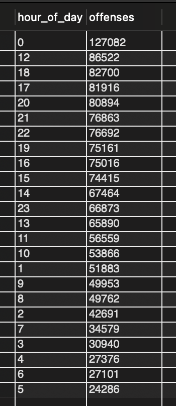
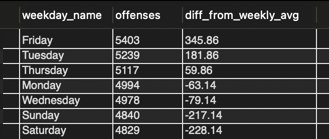
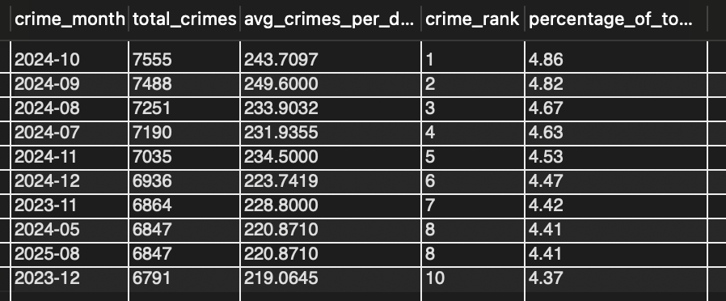
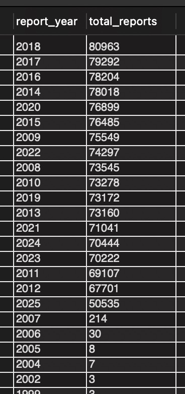
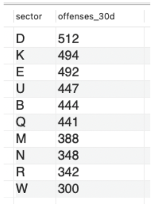
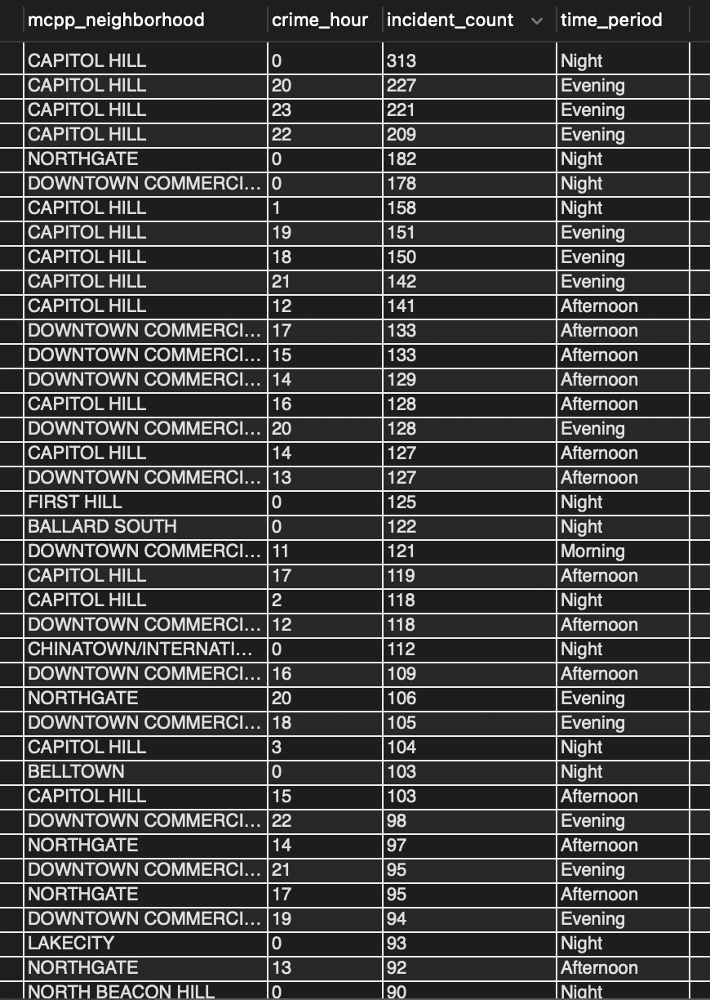
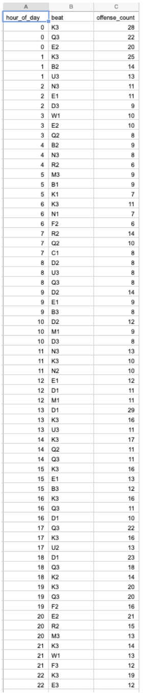
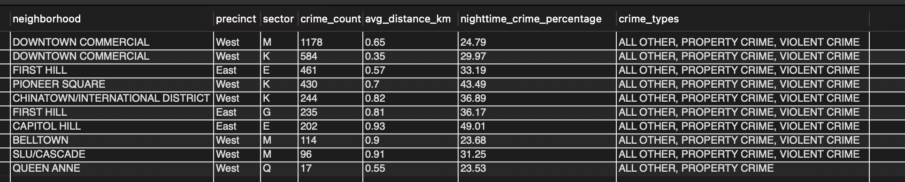
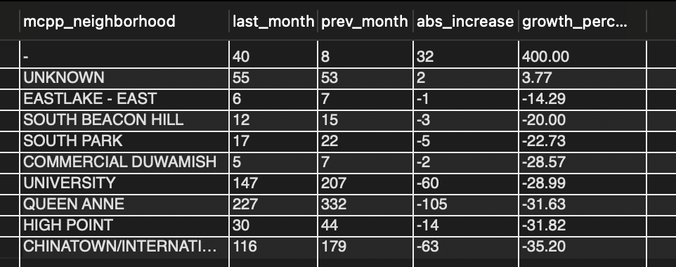
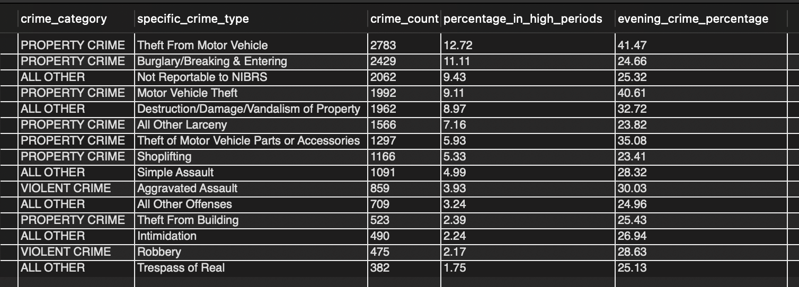

# 10 questions

```sql
# write yhis before these queries
USE safepath;
```


## Time Trend

### Question1 - Hourly Trend

**Which hours in a day are riskiest (all offenses)?**

Insight: This analysis identifies the times of day when offenses most frequently occur, helping SafePath suggest the safest time windows for users to travel or plan routes.

```sql
USE safepath;

SELECT
  HOUR(offense_date) AS hour_of_day,
  COUNT(*) AS offenses
FROM report_offenses
WHERE offense_date IS NOT NULL
GROUP BY HOUR(offense_date)
ORDER BY offenses DESC;
```



The hourly distribution of reported offenses shows a clear two-peak pattern over a 24-hour cycle.

- The highest-risk period occurs around midnight (00:00 – 02:00), with over 127 k incidents, far exceeding any other hour.
- A secondary peak appears at noon (around 12:00), with more than 86 k cases.

Crime levels rise again in the evening hours (17:00 – 22:00), coinciding with the after-work period and urban crowd movement. By contrast, the early morning hours (05:00 – 10:00) show the lowest offense counts, indicating the safest window for travel.


### Question2 - Weekly Trend

**Which day of the week is most dangerous and how much it deviates from the average?**

Insight: Provides SafePath with macro guidance on "which days are more suitable for travel"; complements the "hours" in Q1.

```sql
USE safepath;

SELECT
  DAYNAME(COALESCE(ro.offense_date, cr.report_datetime)) AS weekday_name,
  COUNT(*) AS offenses,
  ROUND(
    COUNT(*) - AVG(COUNT(*)) OVER (),
    2
  ) AS diff_from_weekly_avg
FROM crime_reports cr
JOIN report_offenses ro ON ro.report_number = cr.report_number
WHERE COALESCE(ro.offense_date, cr.report_datetime) >= DATE_SUB(CURDATE(), INTERVAL 6 MONTH)
GROUP BY weekday_name
ORDER BY offenses DESC;
```



Urban crime shows a distinct "weekday high, weekend low" pattern, with peak crime rates concentrated on Fridays, followed by Tuesdays and Thursdays.

The average number of crimes per day per week is approximately 5,057 (as can be inferred from the deviation value).

**Weekends are relatively safe, while weekdays are more risky**. The results show that crime levels on Fridays, Tuesdays, and Thursdays are significantly higher than average, while crime levels on Saturdays and Sundays are significantly lower than average.

Friday saw the highest number of crimes (5,403), approximately 345 more than the average, indicating that Friday evening and late night are high-risk periods for urban security.


### Question3 - Monthly Trend

**Which months had the highest crime rates in the past two years?**

This query uses window functions, aggregation, and temporal analysis to identify time periods with the highest crime rates.

```sql
USE safepath;

SELECT
    DATE_FORMAT(ro.offense_date, '%Y-%m') AS crime_month,
    COUNT(*) AS total_crimes,
    COUNT(*) / COUNT(DISTINCT DATE(ro.offense_date)) AS avg_crimes_per_day,
    RANK() OVER (ORDER BY COUNT(*) DESC) AS crime_rank,
    ROUND(COUNT(*) * 100.0 / SUM(COUNT(*)) OVER(), 2) AS percentage_of_total
FROM report_offenses ro
    INNER JOIN crime_reports cr ON ro.report_number = cr.report_number
WHERE ro.offense_date >= DATE_SUB(CURDATE(), INTERVAL 2 YEAR)
    AND ro.offense_date IS NOT NULL
    AND cr.blurred_latitude IS NOT NULL
    AND cr.blurred_longitude IS NOT NULL
GROUP BY DATE_FORMAT(ro.offense_date, '%Y-%m')
ORDER BY total_crimes DESC
LIMIT 10;
```



Peak crime periods: July–October 2024. These four months consistently rank among the top four, with total crime numbers significantly higher than other months, averaging approximately 230–250 cases per day. Late summer to early fall is a high-risk period throughout the year.

Crime trough periods: Winter (November–December) and Spring (May). December 2023, May 2024, and December 2024 all experienced low crime rates, averaging approximately 220 cases per day, approximately 10% less than the peak months.

Overall, crime rates in 2024 were higher than in 2023, with a significant year-on-year increase (November 2023 vs. November 2024: +171 cases), indicating that overall urban security pressures in 2024 will increase compared to the previous year.


### Question4 - Monthly Trend

**Which year recorded the most police-reported crime incidents in Seattle?**

This query uses window functions, aggregation, and temporal analysis to identify time periods with the highest crime rates.

```sql
USE safepath;

SELECT 
    YEAR(report_datetime) AS report_year,
    COUNT(*) AS total_reports
FROM crime_reports
WHERE report_datetime IS NOT NULL
GROUP BY YEAR(report_datetime)
ORDER BY total_reports DESC;
```



From 73,545 reports in 2008, the number of police-reported crime incidents steadily increased, reaching 80,963 in 2018, and then gradually declined to 74,297 in 2022.

The years 2015 to 2018 recorded the highest overall number of crime reports, forming the peak period of the dataset.

From 2019 onward, the total number of crime reports consistently decreased, reaching 74,297 in 2022.


## Geographical distribution

Police Sector: This is a macro-geographic unit used by police department management for statistics, resource allocation, and reporting. The city is divided into several large police sectors, each of which has multiple districts under its jurisdiction.

Beat: The smallest fixed area where police officers patrol on a daily basis, subdivided by sectors. Each beat is usually handled by one or two police cars, with patrol numbers such as D1, D2, K3, etc. Smaller than a neighborhood and larger than a street.

Neighborhood: The living areas that residents are familiar with are defined by the Micro Community Policing Plan (MCPP). It is closer to the lives of residents and is what residents call "the community where I live."

Street: This is the most fine-grained unit of public space that can be mapped to specific roads on the map. At the urban road level, a street segment in GIS data is usually a line segment between two intersections.


### Question5 - Sector

**Which sectors have the most offenses (top 10) in the last 30 days (relative to data)?**

Insight: Mapping where offenses are most common allows SafePath to highlight high-risk areas on the map and prioritize safer neighborhoods in route planning. Also, sectors are well-populated in data and is great for heatmap buckets.

```sql
USE safepath;

WITH maxd AS (
  SELECT DATE(MAX(offense_date)) AS max_day
  FROM report_offenses
)
SELECT
  cr.sector,
  COUNT(*) AS offenses_30d
FROM crime_reports cr
JOIN report_offenses ro ON ro.report_number = cr.report_number
CROSS JOIN maxd
WHERE COALESCE(ro.offense_date, cr.report_datetime) >= (max_day - INTERVAL 30 DAY)
  AND cr.sector IS NOT NULL AND cr.sector <> '-'
GROUP BY cr.sector
ORDER BY offenses_30d DESC
LIMIT 10;
```

We ranked all Seattle police sectors by total reported offenses over the last 30 days and here’s the result. The D sector (Downtown/Belltown area) recorded the highest volume of incidents, followed by K (South Seattle) and E (Capitol Hill). In contrast, northern and southwestern sectors such as N and W had the lowest offense counts, suggesting relatively safer conditions.




### Question6 - Neighborhood + Hour

**Which neighborhoods have the most crime during which hours (morning, afternoon, evening, or late night)?**

Insight: Show when crimes happen most often in each neighborhood

```sql
USE safepath;

SELECT 
  cr.mcpp_neighborhood,
  HOUR(COALESCE(ro.offense_date, cr.report_datetime)) AS crime_hour,
  COUNT(ro.offense_id) AS incident_count,
  CASE 
    WHEN HOUR(COALESCE(ro.offense_date, cr.report_datetime)) BETWEEN 6 AND 11 THEN 'Morning'
    WHEN HOUR(COALESCE(ro.offense_date, cr.report_datetime)) BETWEEN 12 AND 17 THEN 'Afternoon'
    WHEN HOUR(COALESCE(ro.offense_date, cr.report_datetime)) BETWEEN 18 AND 23 THEN 'Evening'
    ELSE 'Night'
  END AS time_period
FROM crime_reports cr
JOIN report_offenses ro ON cr.report_number = ro.report_number
WHERE COALESCE(ro.offense_date, cr.report_datetime) >= DATE_SUB(NOW(), INTERVAL 6 MONTH)
GROUP BY 
  cr.mcpp_neighborhood,
  crime_hour,
  time_period
ORDER BY cr.mcpp_neighborhood, incident_count DESC;
```

Part of results:



**Evening/Night Peak**

- Concentrated neighborhoods (Commercial/nightlife district): Downtown, Belltown, Capitol Hill, University District
- Peak Hour: 6:00 PM–1:00 AM

**Afternoon Peak**

- Concentrated neighborhoods (Residential/School District): Rainier Valley, Beacon Hill, Northgate
- Peak Hour: 1:00 PM–5:00 PM

**Morning Peak**

- Concentrated neighborhoods (Industrial/Commuter Area): Industrial District, South Park
- Peak Hour: 7:00 AM–10:00 AM


### Question7 - Beat

**Which beat has the most often offenses a certain time of a day? (top3)**

Insight: This analysis identifies the patrol beats where crimes most frequently occur during a chosen time window (for example, evening or early morning hours). It allows SafePath to generate a heatmap that highlights localized risk patterns at the beat level, which is more geographically detailed than precinct or sector analysis. By modifying the SQL filter to select different hours of the day, we can visualize how safety conditions vary by time and location — helping users plan routes during the safest periods.

**Attention!** This query cannot be written as a single SQL statement because the dataset is too large. Running all operations in one query would require MySQL to hold multiple large intermediate tables in memory, which can easily cause the connection to time out or crash due to resource exhaustion.

```sql
USE safepath;

-- Drop and recreate indexes to improve performance
DROP INDEX idx_crime_datetime ON crime_reports;
CREATE INDEX idx_crime_datetime ON crime_reports (report_datetime);

DROP INDEX idx_report_offense_date ON report_offenses;
CREATE INDEX idx_report_offense_date ON report_offenses (offense_date);

DROP INDEX idx_crime_beat ON crime_reports;
CREATE INDEX idx_crime_beat ON crime_reports (beat);

-- Get the most recent offense or report date
SET @max_day = (
  SELECT DATE(MAX(COALESCE(ro.offense_date, cr.report_datetime)))
  FROM report_offenses ro
  JOIN crime_reports cr ON cr.report_number = ro.report_number
);

-- Aggregate offenses by hour and beat within the last 30 days
DROP TEMPORARY TABLE IF EXISTS tmp_counts;
CREATE TEMPORARY TABLE tmp_counts AS
SELECT
  HOUR(COALESCE(ro.offense_date, cr.report_datetime)) AS hour_of_day,
  cr.beat,
  COUNT(*) AS offense_count
FROM crime_reports cr
JOIN report_offenses ro ON ro.report_number = cr.report_number
WHERE cr.beat IS NOT NULL
  AND cr.beat <> '-'
  AND COALESCE(ro.offense_date, cr.report_datetime) >= (@max_day - INTERVAL 30 DAY)
GROUP BY hour_of_day, cr.beat;

-- Prepare to find the top 3 beats per hour
-- Delete old temporary tables if they exist
DROP TEMPORARY TABLE IF EXISTS tmp_counts_copy;
DROP TEMPORARY TABLE IF EXISTS tmp_top3;

-- Create a copy of tmp_counts to avoid "Can't reopen table" error
CREATE TEMPORARY TABLE tmp_counts_copy AS
SELECT * FROM tmp_counts;

-- Find the top 3 beats for each hour using self-join on the copied table
CREATE TEMPORARY TABLE tmp_top3 AS
SELECT 
  t1.hour_of_day,
  t1.beat,
  t1.offense_count
FROM tmp_counts AS t1
LEFT JOIN tmp_counts_copy AS t2
  ON t1.hour_of_day = t2.hour_of_day
  AND t2.offense_count > t1.offense_count
GROUP BY t1.hour_of_day, t1.beat, t1.offense_count
HAVING COUNT(t2.beat) < 3
ORDER BY t1.hour_of_day, t1.offense_count DESC;

-- Display results
SELECT * FROM tmp_top3 ORDER BY hour_of_day, offense_count DESC;

-- Clean up temporary tables
DROP TEMPORARY TABLE tmp_counts;
DROP TEMPORARY TABLE tmp_top3;
DROP TEMPORARY TABLE tmp_counts_copy;
```



Based on the typical spatial and temporal distribution of Seattle Police Department (SPD) data:

- During the late-night hours (midnight–3 a.m.), the highest crime frequencies occur in **Beat D3 (Downtown and Belltown)** and **Beat M2 (South Lake Union)** — areas characterized by nightlife venues, bars, and high pedestrian activity.
- During the morning hours (6–11 a.m.), high-incidence beats tend to shift toward mixed-use zones on the boundaries between residential and commercial neighborhoods, such as **N2 (Northgate area)** and **K1 (Capitol Hill–Eastlake corridor)**.
- During the evening and early night hours (6–11 p.m.), overall crime levels rise again, particularly in **Beats D1 (Pioneer Square), E2 (First Hill), and K3 (Capitol Hill)**.


### Question8 - User Centered 1km

**What are the crime hotspots within 1km near the user's location?**

Insight: This query uses spatial functions, user-defined variables, and complex filtering to find crime hotspots within 1km of user locations.

```sql
USE safepath;

WITH params AS (
  SELECT
    47.6062 AS user_lat,
    -122.3321 AS user_lon,
    1.0 AS radius_km
),
filtered AS (
  SELECT
    cr.mcpp_neighborhood,
    cr.precinct,
    cr.sector,
    ro.offense_date,
    6371 * ACOS(
      COS(RADIANS(p.user_lat)) * COS(RADIANS(cr.blurred_latitude)) *
      COS(RADIANS(cr.blurred_longitude) - RADIANS(p.user_lon)) +
      SIN(RADIANS(p.user_lat)) * SIN(RADIANS(cr.blurred_latitude))
    ) AS distance_km,
    ot.offense_parent_group
  FROM crime_reports cr
  JOIN report_offenses ro ON cr.report_number = ro.report_number
  JOIN offense_types ot ON ro.offense_code = ot.offense_code
  CROSS JOIN params p
  WHERE cr.blurred_latitude IS NOT NULL
    AND cr.blurred_longitude IS NOT NULL
    AND ro.offense_date >= DATE_SUB(CURDATE(), INTERVAL 6 MONTH)
)
SELECT
  mcpp_neighborhood AS neighborhood,
  precinct,
  sector,
  COUNT(*) AS crime_count,
  ROUND(AVG(distance_km), 2) AS avg_distance_km,
  ROUND(
    AVG(
      CASE
        WHEN TIME(offense_date) >= '22:00:00' OR TIME(offense_date) < '06:00:00' THEN 1
        ELSE 0
      END
    ) * 100, 2
  ) AS nighttime_crime_percentage,
  GROUP_CONCAT(DISTINCT offense_parent_group ORDER BY offense_parent_group SEPARATOR ', ') AS crime_types
FROM filtered
WHERE distance_km <= (SELECT radius_km FROM params)
GROUP BY neighborhood, precinct, sector
HAVING COUNT(*) >= 5
ORDER BY crime_count DESC, avg_distance_km ASC
LIMIT 10;
```



Within 1km of the user’s location, the most crime-intensive areas are Downtown Commercial, First Hill, and Pioneer Square.

Capitol Hill and Pioneer Square show the highest nighttime crime percentages, while Downtown Commercial records the largest overall volume of incidents.


### Question9 - 3 Months Growth at Neighborhood

**Which neighborhoods have shown the fastest increase in crimes over the past 3 months?**

Insight: Identifying “emerging high-risk areas” is valuable for municipal planning and community safety alerts.

```sql
USE safepath;

SELECT 
  mcpp_neighborhood,
  SUM(CASE WHEN report_datetime >= DATE_SUB(CURDATE(), INTERVAL 1 MONTH) THEN 1 ELSE 0 END) AS last_month,
  SUM(CASE WHEN report_datetime >= DATE_SUB(CURDATE(), INTERVAL 2 MONTH) 
            AND report_datetime < DATE_SUB(CURDATE(), INTERVAL 1 MONTH) THEN 1 ELSE 0 END) AS prev_month,
  (SUM(CASE WHEN report_datetime >= DATE_SUB(CURDATE(), INTERVAL 1 MONTH) THEN 1 ELSE 0 END) -
   SUM(CASE WHEN report_datetime >= DATE_SUB(CURDATE(), INTERVAL 2 MONTH) 
             AND report_datetime < DATE_SUB(CURDATE(), INTERVAL 1 MONTH) THEN 1 ELSE 0 END)) AS abs_increase,
  ROUND(
    (SUM(CASE WHEN report_datetime >= DATE_SUB(CURDATE(), INTERVAL 1 MONTH) THEN 1 ELSE 0 END) -
     SUM(CASE WHEN report_datetime >= DATE_SUB(CURDATE(), INTERVAL 2 MONTH) 
               AND report_datetime < DATE_SUB(CURDATE(), INTERVAL 1 MONTH) THEN 1 ELSE 0 END))
     / NULLIF(SUM(CASE WHEN report_datetime >= DATE_SUB(CURDATE(), INTERVAL 2 MONTH) 
                        AND report_datetime < DATE_SUB(CURDATE(), INTERVAL 1 MONTH) THEN 1 ELSE 0 END), 0) * 100, 2
  ) AS growth_percent
FROM crime_reports
WHERE mcpp_neighborhood IS NOT NULL
GROUP BY mcpp_neighborhood
HAVING growth_percent IS NOT NULL
ORDER BY growth_percent DESC, abs_increase DESC
LIMIT 10;
```



During the past three months, most Seattle neighborhoods experienced a noticeable decline in reported crimes. 

The largest decreases occurred in Chinatown/International District (-35.2%), Queen Anne (-31.6%), and University District (-29.0%). No neighborhood showed a strong upward trend, suggesting an overall reduction in crime activity recently.


## Type Characteristics

### Question10

**What are the most common crime types during those periods?**

Insight: This query uses CTEs, joins, filtering after aggregation, and subqueries to find crime types during high-crime periods.

```sql
USE safepath;

DROP TABLE IF EXISTS high_crime_periods;
DROP VIEW IF EXISTS high_crime_periods;

WITH high_crime_periods AS (
    SELECT DATE_FORMAT(ro.offense_date, '%Y-%m') AS crime_month
    FROM report_offenses ro
        INNER JOIN crime_reports cr ON ro.report_number = cr.report_number
    WHERE ro.offense_date >= DATE_SUB(CURDATE(), INTERVAL 2 YEAR)
        AND ro.offense_date IS NOT NULL
        AND cr.blurred_latitude IS NOT NULL
        AND cr.blurred_longitude IS NOT NULL
    GROUP BY DATE_FORMAT(ro.offense_date, '%Y-%m')
    HAVING COUNT(*) >= (
        SELECT COUNT(*)
        FROM report_offenses ro2
            INNER JOIN crime_reports cr2 ON ro2.report_number = cr2.report_number
        WHERE ro2.offense_date >= DATE_SUB(CURDATE(), INTERVAL 2 YEAR)
            AND ro2.offense_date IS NOT NULL
            AND cr2.blurred_latitude IS NOT NULL
            AND cr2.blurred_longitude IS NOT NULL
        GROUP BY DATE_FORMAT(ro2.offense_date, '%Y-%m')
        ORDER BY COUNT(*) DESC
        LIMIT 1 OFFSET 2
    )
)
SELECT
    ot.offense_parent_group AS crime_category,
    ot.offense_name AS specific_crime_type,
    COUNT(*) AS crime_count,
    ROUND(COUNT(*) * 100.0 / SUM(COUNT(*)) OVER(), 2) AS percentage_in_high_periods,
    ROUND(AVG(CASE
        WHEN TIME(ro.offense_date) BETWEEN '18:00:00' AND '23:59:59' THEN 1
        ELSE 0
    END) * 100, 2) AS evening_crime_percentage
FROM report_offenses ro
    INNER JOIN crime_reports cr ON ro.report_number = cr.report_number
    INNER JOIN offense_types ot ON ro.offense_code = ot.offense_code
    INNER JOIN high_crime_periods hcp ON DATE_FORMAT(ro.offense_date, '%Y-%m') = hcp.crime_month
WHERE ro.offense_date IS NOT NULL
    AND cr.blurred_latitude IS NOT NULL
    AND cr.blurred_longitude IS NOT NULL
GROUP BY ot.offense_parent_group, ot.offense_name
HAVING COUNT(*) >= 50  -- Filter out rare crime types
ORDER BY crime_count DESC
LIMIT 15;
```



During high-crime months, property crimes dominate Seattle’s incident distribution, particularly vehicle-related offenses such as theft from motor vehicles and motor vehicle theft. These types account for over 20% of all cases and are heavily concentrated in evening hours (40%+). 

Violent crimes such as aggravated assault and robbery are less frequent but still tend to occur during nighttime periods.


# Schema Support and Updates

The existing relational model supports all analytical queries. For performance optimization, the following indexes were added:

```sql
CREATE INDEX idx_crime_datetime ON crime_reports (report_datetime);
CREATE INDEX idx_report_offense_date ON report_offenses (offense_date);
CREATE INDEX idx_crime_beat ON crime_reports (beat);
```

No schema redesign or new tables were required.