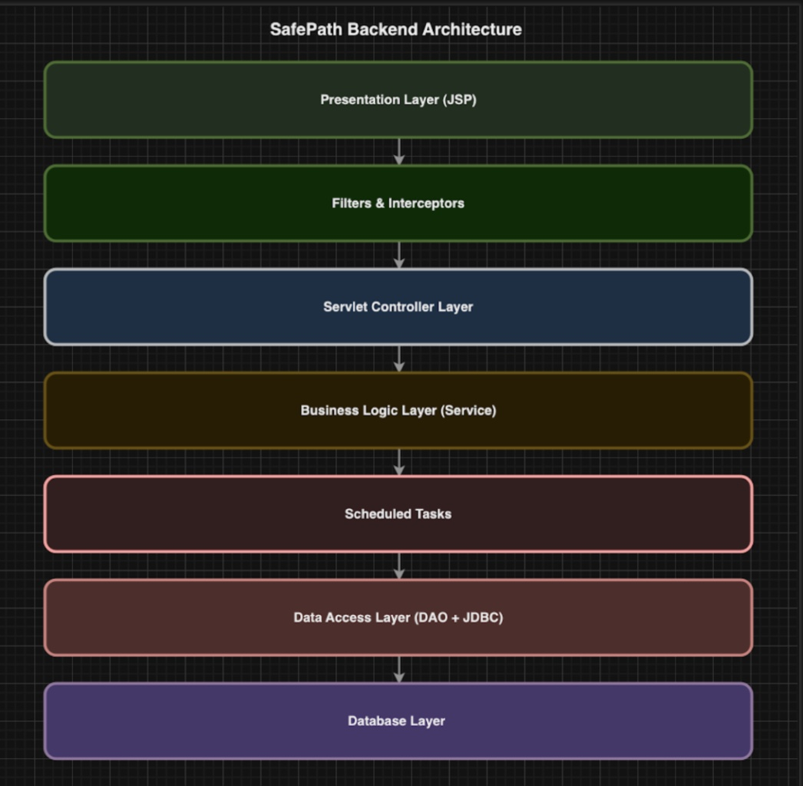

# Backend (JDBC + DAO)


## Overall Architecture

The backend of this project follows a **JDBC + Servlet + DAO layered architecture**, structured as follows:

```
Controller (Servlet)
        ↓
Service (Business Logic Layer)
        ↓
DAO (Data Access Layer)
        ↓
JDBC (ConnectionManager)
        ↓
Database (MySQL Mode)
```

- The **Controller layer** receives HTTP requests from JSP pages and determines the requested CRUD operation (create, read, update, delete) based on the parameters. It then invokes the appropriate Service or DAO method, attaches results to the request attributes, and forwards the response back to the JSP page.
- The **DAO layer** contains one DAO class per database table. Each DAO uses JDBC `PreparedStatement` to execute SQL queries and perform CRUD operations, working closely with the corresponding entity classes (User, CrimeReport, UserAlert).
- The **JDBC ConnectionManager** centralizes database connection handling. It reads configuration values from `application.properties`, provides a unified `getConnection()` method, and ensures reliable connection management for all DAO classes.




## Database Schema

The database consists of three core tables, each supporting one major module of the application.

### users

| Column        | Type               | Notes           |
| ------------- | ------------------ | --------------- |
| user_id       | INT AUTO_INCREMENT | PK              |
| email         | VARCHAR            | unique          |
| password_hash | VARCHAR            | hashed password |
| created_at    | TIMESTAMP          | auto generated  |

### crime_reports

| Column            | Type       |
| ----------------- | ---------- |
| report_number     | VARCHAR PK |
| report_datetime   | TIMESTAMP  |
| precinct          | VARCHAR    |
| sector            | VARCHAR    |
| beat              | VARCHAR    |
| mcpp_neighborhood | VARCHAR    |
| blurred_address   | VARCHAR    |
| blurred_latitude  | DOUBLE     |
| blurred_longitude | DOUBLE     |

### user_alerts

| Column            | Type                   |
| ----------------- | ---------------------- |
| alert_id          | INT PK auto_increment  |
| user_id           | INT FK → users.user_id |
| radius_m          | INT                    |
| center_lat        | DOUBLE                 |
| center_lon        | DOUBLE                 |
| crime_type_filter | VARCHAR                |
| active_flag       | BOOLEAN                |
| created_at        | TIMESTAMP              |
| updated_at        | TIMESTAMP              |


## CRUD

### User CRUD

| HTTP Method | Endpoint               | Description                                      | Parameters                           |
| ----------- | ---------------------- | ------------------------------------------------ | ------------------------------------ |
| **GET**     | `/users`               | Retrieves all users; supports optional search    | `searchEmail` (optional)             |
| **GET**     | `/users?id={userId}`   | Retrieves detailed information for a single user | `id` (required)                      |
| **POST**    | `/users?action=create` | Creates a new user                               | `email`, `password`                  |
| **POST**    | `/users?action=update` | Updates an existing user                         | `id`, `email`, `password` (optional) |
| **POST**    | `/users?action=delete` | Deletes a user                                   | `id`                                 |

### Crime Reports CRUD

| HTTP Method | Endpoint                         | Description                                              | Parameters                                                   |
| ----------- | -------------------------------- | -------------------------------------------------------- | ------------------------------------------------------------ |
| **GET**     | `/crimeReports`                  | Retrieves all crime reports; supports multi-field search | `searchReportNumber`, `searchPrecinct`, `searchNeighborhood` (optional) |
| **GET**     | `/crimeReports?reportNumber={X}` | Retrieves a single crime report by report number         | `reportNumber`                                               |
| **POST**    | `/crimeReports?action=create`    | Creates a new crime report                               | Multiple form fields (all report attributes)                 |
| **POST**    | `/crimeReports?action=update`    | Updates an existing crime report                         | Multiple form fields                                         |
| **POST**    | `/crimeReports?action=delete`    | Deletes a crime report                                   | `reportNumber` (or corresponding primary key field)          |

### User Alerts CRUD

| HTTP Method | Endpoint                | Description                                         | Parameters                                                 |
| ----------- | ----------------------- | --------------------------------------------------- | ---------------------------------------------------------- |
| **GET**     | `/alerts`               | Retrieves all user alerts; supports optional search | `searchUserId`, `searchAlertId` (optional)                 |
| **GET**     | `/alerts?id={alertId}`  | Retrieves detailed information for a single alert   | `id` (alertId)                                             |
| **POST**    | `/alerts?action=create` | Creates a new user alert                            | Form fields (`radius_m`, `center_lat`, `center_lon`, etc.) |
| **POST**    | `/alerts?action=update` | Updates an existing user alert                      | Multiple alert fields                                      |
| **POST**    | `/alerts?action=delete` | Deletes a user alert                                | `id` (alertId)                                             |


## DAO Layer and JDBC Workflows Example


### CREATE Workflow

**Workflow Explanation**

1. The user fills in the **Email** and **Password** fields in the JSP form and submits the request.

2. The `UserServlet` receives the request and detects that `action=create`.

3. The Servlet invokes `UserDAO.createUser()`.

4. The DAO constructs and executes the following SQL statement:

   ```sql
   INSERT INTO users (email, password_hash, created_at)
   VALUES (?, ?, NOW());
   ```

5. A JDBC connection is retrieved from the `ConnectionManager`, and a `PreparedStatement` is executed.

6. After a successful insertion, the Servlet redirects the user back to the user list page.


### READ Workflow

**Workflow Explanation**

To retrieve all users:

```sql
SELECT * FROM users ORDER BY user_id DESC;
```

To retrieve a single user by ID:

```sql
SELECT * FROM users WHERE user_id = ?;
```

The DAO maps each result row to a `User.java` entity object and returns it to the Servlet, which then forwards the data to the JSP page for rendering.


### UPDATE Workflow

**Workflow Explanation**

1. The user clicks the “Edit” button on the list page.

2. The Servlet loads the existing user and pre-fills the edit form in the JSP.

3. After the user submits the form, the Servlet detects `action=update`.

4. The DAO executes the following SQL statement:

   ```sql
   UPDATE users 
   SET email = ?, password_hash = ?
   WHERE user_id = ?;
   ```

5. If the password field is left empty, the original password is preserved (handled in the Servlet logic).

6. After a successful update, the user is redirected back to the list page.


### DELETE Workflow

**Workflow Explanation**

1. The user clicks the “Delete” button on the list page.

2. The Servlet detects `action=delete` and calls the DAO method that executes:

   ```sql
   DELETE FROM users WHERE user_id = ?;
   ```

3. After successful deletion, the application returns to the user list view.


## Advanced Feature

The advanced feature selected in **Milestone 1** is the **User Alert System**.

This feature allows each user to configure a personal *geofence-based safety alert*, where the system monitors crime activity within a user-defined geographic radius.

### **Key Capabilities**

1. Users can create custom **geofence alerts**.
2. The backend processes user-selected geofence parameters:
   - `center_lat`
   - `center_lon`
   - `radius_m`
3. The frontend displays all crime reports that fall within the user’s configured area.
4. All alert configurations are stored in the `user_alerts` table.

### API Endpoints for Advanced Feature

```
GET  /alerts
GET  /alerts?id={alertId}
POST /alerts?action=create
POST /alerts?action=update
POST /alerts?action=delete
```


## Build & Run Instructions

```bash
# Build the WAR package
mvn package

# Local Development (Recommended)
mvn jetty:run

# Deploy to Apache Tomcat
Copy target/*.war into the Tomcat webapps/ directory.
```


# Frontend (JSP) 


## Overview

The frontend of this project is built using traditional JSP-based server-side rendering, combined with modern JavaScript modules for dynamic map interaction and data visualization. It consists of three major layers:

- **View Layer**
   `index.jsp` serves as the main entry point of the application, designated as the welcome page through `web.xml`.
- **Styling Layer**
   `style.css` defines the global layout, including the top navigation bar, left-side information panel, right-side map container, and expandable route detail cards.
- **Script Layer**
  - **`map.js`**: Initializes the Google Maps interface, handles route planning, Place Autocomplete, and integrates crime overlay data.
  - **`crime.js`**: Fetches crime reports from the backend `/crime-report` API based on geographic and temporal filters, updates the sidebar list, and renders crime markers on the map.


## Page Structure: `index.jsp`

The user interface follows a classic **“Sidebar + Map” single-page layout**, where JavaScript fetches data asynchronously from backend servlets. All map updates and crime data rendering occur without reloading the page.


Because `web.xml` sets `index.jsp` as the **welcome file**, visiting the root path `/` automatically loads this interface.

### Top Navigation Bar — `.header`

Styled via `.header` in `style.css`, this section provides:

- Left: Application logo (`.logo`)
- Center: Search input (`.search-input`), used for general search or location input
- Right: Authentication buttons (`.auth-buttons`) for login and registration

### Main Layout — `.main`

The central portion of the UI is a horizontal flex container containing:

- **Left Panel (`.sidebar`, ~30% width)**
   Displays crime reports and route information.
- **Right Map Area (`.map-area`)**
   Contains the Google Map initialized by `map.js`.

Key DOM elements referenced in the JavaScript modules include:

| Element                                   | Purpose                                             |
| ----------------------------------------- | --------------------------------------------------- |
| `.alert-list`                             | Populated by `crime.js` with crime report summaries |
| `#map`                                    | Google Maps container                               |
| `#route-details`                          | Dynamic route summary panel (from `map.js`)         |
| `#location-input` / `.search-destination` | Fields for Place Autocomplete                       |


### JavaScript and Google Maps Script Loading

At the bottom of `index.jsp`, the application loads:

```html
<script type="module" src="map.js"></script>
```

The Google Maps JavaScript API is loaded using:

```html
<script src="https://maps.googleapis.com/maps/api/js?key=...&callback=initMap&libraries=places"></script>
```

Because Google Maps requires a global callback, `map.js` registers:

```js
window.initMap = initMap;
```

This mechanism is central to the advanced feature integration—once the map finishes initializing, the system automatically triggers crime-data loading based on the current map viewport.


## JavaScript Modules

The core frontend logic is organized into two ES module–based JavaScript files: **`crime.js`** and **`map.js`**. These modules work together to provide crime visualization, route planning, and real-time geographic filtering.


### `crime.js`

Crime Data Loading & Visualization Module

`crime.js` is responsible for fetching and rendering crime reports on the page. Its key functions include:

- Requesting crime data from the backend based on the **current map viewport** and **selected time range**
- Rendering crime reports in the left-side list panel (`.alert-list`)
- Adding crime markers to the Google Map, with icons and info windows

This module is automatically triggered whenever the map view changes, ensuring that the displayed crime data always matches the visible geographic area.

###  `map.js`

Map Initialization, Route Planning & Crime Integration

`map.js` serves as the central controller for all map-related interactions and visualization features. It provides:

1. **Map Initialization**
    Creates the Google Map instance and attaches it to `window.map`.
2. **Place Autocomplete**
    Enables address autocompletion for both origin and destination input fields.
3. **Route Calculation**
    Uses the Google Directions API to compute and display multiple alternative routes on the map.
4. **Viewport-Based Crime Loading**
    Detects whenever the map is moved or zoomed, computes the geographic bounding box, and triggers `crime.js` to fetch and display relevant crime reports.

Through these mechanisms, `map.js` acts as the bridge between user interactions, crime data visualization, and route planning.


## style.css

The `style.css` stylesheet defines the visual structure and appearance of the entire application, including:

- The top navigation bar
- The sidebar layout for crime lists and route details
- The map container
- The expandable route detail cards
- Spacing, typography, colors, and flexbox layout rules

It ensures that the user interface remains consistent, readable, and aligned with modern web design standards.


## Advanced Feature Description

The advanced feature integrates **Google Maps route planning** with **geographically and temporally filtered crime visualization** into a unified interactive map interface. This provides a safety-aware navigation experience.

### **Feature Workflow**

Whenever the user opens the page, drags the map, or zooms in/out:

1. The frontend calculates the visible bounding box:
   - Minimum/maximum latitude (`minLat`, `maxLat`)
   - Minimum/maximum longitude (`minLon`, `maxLon`)
2. A time filter (e.g., **last 50 days**) is applied.
3. The system sends a request to the backend endpoint:

```
/crime-report?action=range
```

with both geographic and temporal parameters.

1. The backend returns all crime reports that fall within the specified range.
2. The returned data is used for:
   - Displaying a crime list in the left `.alert-list`
   - Plotting crime markers dynamically on the map


### **Integrated UI Effects**

Although route planning and crime visualization are implemented in separate modules, they support each other when presented together:

- The map simultaneously displays **user-generated routes** and **local crime hotspots**
- The sidebar contains both **detailed route information** and **crime report summaries**
- Users can visually assess which route avoids higher-risk areas

This combined system enhances user safety awareness and supports smarter decision-making during route selection.


# Advanced Feature Plan

Machine Learning Crime Classification & Prediction Model

This advanced feature extends the existing Crime Report Management System by introducing a **Machine Learning (ML) module** designed to analyze historical crime data, extract behavioral patterns, and perform risk prediction.

By training ML models on structured historical data, the system can automatically predict the likely crime category or risk level based on user-provided inputs such as neighborhood, time, weapon type, or domestic violence indicators. This enhancement upgrades the system from a simple information dashboard into an **intelligent decision-support platform**.

During this milestone, we completed the model training, evaluation scripts, and produced deployable model files. In the next milestone, the prediction logic will be integrated into the Servlet layer and exposed directly to the frontend.


## Dataset Preparation

The ML module uses multiple fields from the historical crime dataset, including (but not limited to):

- `crime_category`
- `neighborhood`
- `report_datetime`
- `weapon`
- `domestic_violence_flag`
- `precinct`

Data preprocessing steps include:

- Missing value handling
- Encoding categorical fields (label encoding / one-hot encoding)
- Normalizing numerical attributes
- Splitting the dataset into training and test sets

These steps ensure that the dataset is clean and suitable for statistical modeling.


## ML Model Structure

According to the specifications outlined in `ML_changes.readme`, the ML pipeline consists of the following components.

### Feature Engineering

- Converts raw database records into numerical feature vectors
- Encodes geographic features, crime types, and temporal patterns
- Ensures consistent feature columns for all ML models

### Model Selection

Depending on task requirements (classification vs. prediction), the ML module supports interchangeable model architectures, including:

- Logistic Regression
- Random Forest
- Decision Tree
- Naive Bayes
- Additional modular model configurations

> The implementation uses **Java + Weka** or **Python + Scikit-Learn**, depending on the training environment described in the team’s documentation.

### Model Training

Training scripts load data from CSV files or the database and export persistent model artifacts such as:

- `.model` (Weka binary format)
- `.pkl` (Scikit-Learn pickle format)

Training results include:

- Accuracy score
- Confusion matrix
- Feature importance ranking

These evaluation metrics help determine which model structure performs best for deployment.


## Integration with the Web System

The trained ML model will be integrated into the backend through:

- **CrimeReportServlet** — for real-time prediction requests
- **JSP frontend** — for visualizing the prediction output

Workflow:

1. The user fills out crime-related attributes on the frontend form.
2. The frontend sends these attributes to the Servlet.
3. The Servlet loads and executes the ML model for prediction.
4. The predicted crime category or risk level is returned to the JSP page.

This integration allows end users to interactively test hypothetical scenarios and view real-time crime predictions.


## UI/UX Workflow

A dedicated **“Crime Prediction”** input panel is added to the user interface.

### **User Flow**

1. The user selects or enters:
   - Neighborhood
   - Date/time
   - Optional factors (weapon type, domestic violence flag, etc.)
2. The user clicks **“Predict Crime Type / Risk Level”**.
3. The frontend sends these inputs to the ML prediction endpoint.
4. The prediction result is returned and displayed beneath the form.

This design provides a simple, intuitive interface for experimenting with the ML model and understanding crime pattern tendencies.

